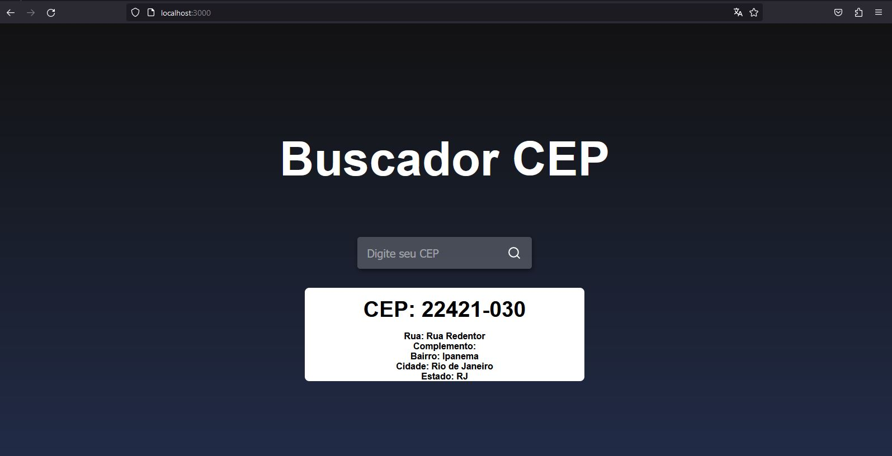

**# Projeto React JS com React Icons e Consumo da API Via CEP**

## Descrição do Projeto

Este é um projeto simples desenvolvido com React JS que utiliza a biblioteca React Icons para exibição de ícones e consome a API do Via CEP para obter informações sobre um CEP e exibi-las na interface.



## Funcionalidades

1. **Consulta de CEP:** O usuário pode inserir um CEP na interface, e o sistema faz uma requisição à API do Via CEP para obter informações sobre o endereço associado ao CEP.

2. **Exibição de Informações:** As informações obtidas da API, como logradouro, bairro, cidade e estado, são exibidas na interface para o usuário.

3. **Ícones Personalizados:** A interface utiliza ícones personalizados fornecidos pela biblioteca React Icons para uma experiência visual mais atraente.

## Tecnologias Utilizadas

- **React JS:** Biblioteca JavaScript para construção de interfaces de usuário.
- **React Icons:** Biblioteca que fornece ícones personalizados para uso em projetos React.
- **Via CEP API:** API gratuita para consulta de informações de endereços a partir de um CEP.

## Como Executar o Projeto

1. Clone o repositório para sua máquina local:

   ```bash
   git clone https://github.com/nathanmota-dev/Buscador-Cep-ReactJs
   ```

2. Navegue até o diretório do projeto:

   ```bash
   cd Buscador-Cep-ReactJs
   ```

3. Instale as dependências:

   ```bash
   npm install
   ```

4. Inicie o servidor de desenvolvimento:

   ```bash
   npm start
   ```

5. Abra seu navegador e acesse [http://localhost:3000](http://localhost:3000) para visualizar o projeto em execução.

## Contribuições

Contribuições são bem-vindas! Sinta-se à vontade para abrir issues ou pull requests para melhorar este projeto.

## Licença

Este projeto está licenciado sob a Licença MIT.